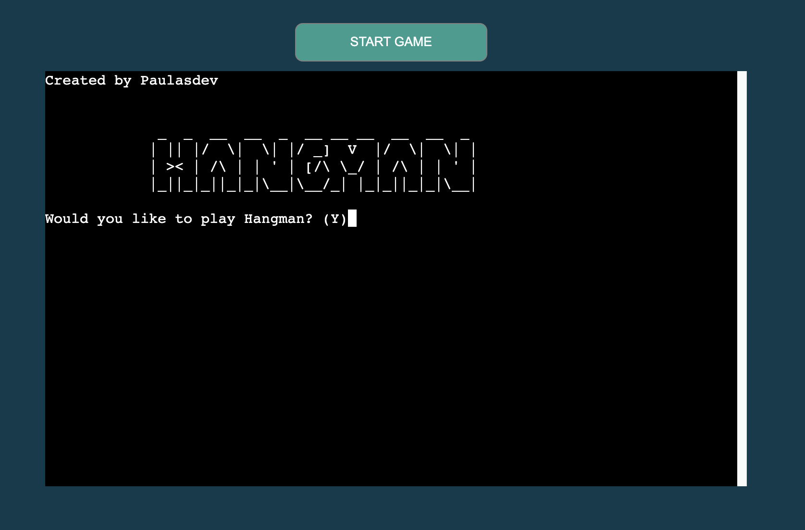

# **Hangman Game**

Hangman is a game to try to guess words related to the English language where the user types a letter to try to form a random word. The user can commit a maximum of 8 errors.

The site was deployed via Heroku: [Hangman-Game](https://hangman-gamep3.herokuapp.com/)

# Table of Contents
* [UX](#ux "UX")
    * [User Goals](#user-goals "User Goals")
    * [User Stories](#user-stories "User Stories")
    * [Site Owners Goals](#site-owners-goals)
    * [How to Play](#how-to-play)
    * [Design](#design)
        * [Fonts](#fonts)
        * [Colours](#colours)
        * [Images](#images)
        * [Structure](#structure)
    * [Features](#Features)
    * [Technologies used](#technologies-used)
        * [Languages](#languages)
        * [Libraries and Frameworks](#libraries-and-frameworks)
        * [Tools](#tools)
    * [Testing](#testing)
    * [Deployment](#deployment)
    * [Acknowledgements](#Acknowledgements)
# UX 
### User Goal

- Want to easily navigate through the game with simple inputs.

### User stories
- Be able to enter my name
- Show me the wrong words I typed
- Show how many lives are left
- Show the correct word

### Site Owners Goals
- Ensuring that game functions are working perfectly

## How to Play
- The user enters his name and the option if he wants to play.
- A random word is selected and the user can type a letter.
- The user is able to  see how many lives they have. The user need to typing a letter, if it is correct it will appear in the word or else it will take a life and a frame from the hangman.
- All typed letters are shown below the lives.
- The user continues typing until guess the correct word and/or run out of life.
- If the user gets the right word, he/she will receive a Congratulations message. If the user doesn't guess the correct word, it will be shown at the end.
- The user can choose to play again and then a new random word is generated otherwise the user is directed to the home screen to enter his name again.

## Design 

### Fonts
I used the standard monospace font provided by Code Institute template

### Colors

### Flowchart

### Images
I used [patorjk.com](https://patorjk.com/software/taag/#p=display&f=Stforek&t=Hangman) for create the logo

## Features
Home screem - message if user would like to play.

Enter your username.

The game starts, a random word is generated and the user has to type the letters until he guesses the correct word. The user sees the name and the number of lives he has left

All letters already used are displayed on the screen

At the end of the game, the correct word is shown and the user can choose whether or not to play again.

## Technologies used
## Languages
* [Python](https://en.wikipedia.org/wiki/Python_(programming_language) "Python") for the game code
* [HTML](https://en.wikipedia.org/wiki/HTML5 "HTML") for the structure of the site
* [CSS](https://en.wikipedia.org/wiki/CSS "CSS") for the design of the site
* [Markdown](https://en.wikipedia.org/wiki/Markdown) for the content in my README file

## Libraries and Frameworks

* For selecting a random card from the deck [python random library](https://docs.python.org/3/library/random.html?#module-random ".py random")

## Tools

* For construction [Gitpod](https://www.gitpod.io/ "Gitpod")
* For wireframes [Balsamic](https://balsamiq.com/wireframes/ "Balsamic")
* For python validation [PEP8 online](http://pep8online.com/ "PEP8")
* For HTML validation [W3C HTML Validation Service](https://validator.w3.org/ "W3C HTML")
* For CSS validation [W3C CSS Validation Service](https://jigsaw.w3.org/css-validator/ "W3C CSS")
* For python code validation [PEP8 online](http://pep8online.com/ "PEP8")
* For general code queries [W3Schools](https://www.w3schools.com/ "W3Schools")
* For python queries [python](https://www.python.org/ "py")
* For spell checking [Grammarly](https://chrome.google.com/webstore/detail/grammarly-for-chrome/kbfnbcaeplbcioakkpcpgfkobkghlhen/related?hl=en "Grammarly")
* For the API [Google Cloud Platform](https://en.wikipedia.org/wiki/Google_Cloud_Platform "GCP") 

## Testing
Using the [PEP8](http://pep8online.com/) code validator for the Python code,

## Deployment
The site was deployed to Heroku pages. The steps to deploy are as follows:

- Log in Heroku.
- Click **New** and select 'Create new app'
- Choose a name for the app, region and click on 'Create app'.
- Only 'Deploy' and 'Settings' are relevant from the menu section. Starting with the 'Settings' first.
- Now Buildpacks need to be added. They install future dependencies that are needed outside of the requirements file. The first is Python and the second is node.js. Python needs to be selected first and then node.js. Save this selection.
- Now the 'Deploy' section needs to be selected from the menu and connect it to github.
- Enter the name of the repository we want to connect it with and click 'Connect'
- The choice appears now to either deploy using automatic deploys or manual deployment, which deploys the current state of the branch.
- Click deploy branch.

## Acknowledgements
This is a game for Project 3 for the Full Stack Software Developer program with Code Institute.