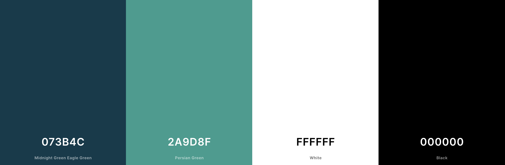
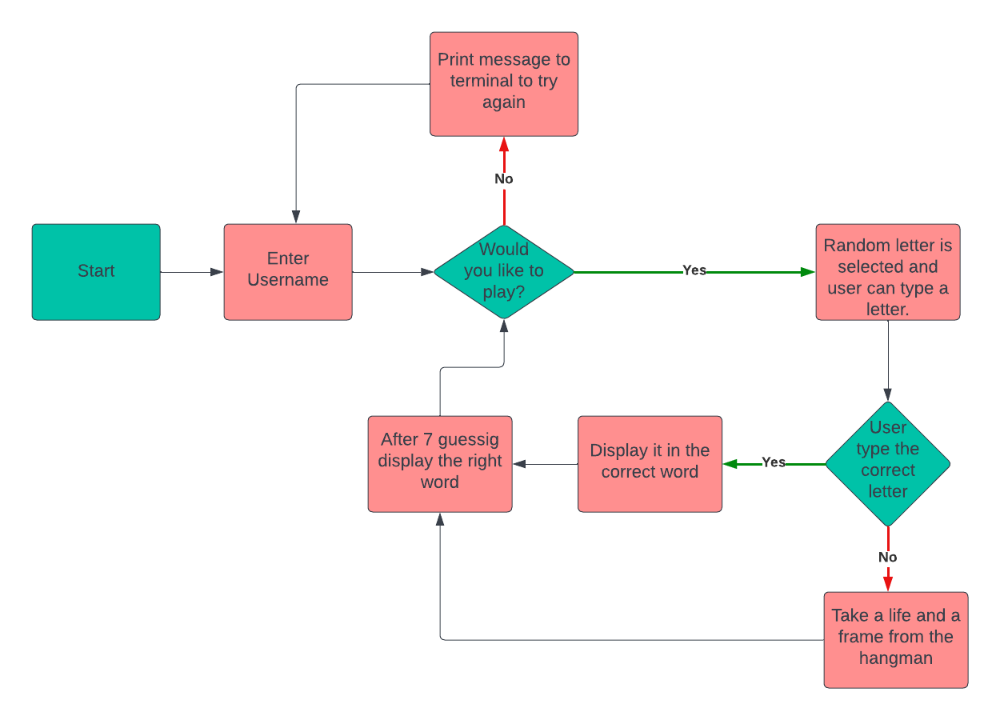

# **Hangman Game**

Hangman is a game to try to guess words related to the English language where the user types a letter to try to form a random word. The user can commit a maximum of 8 errors.

[Hangman-Game](https://hangman-gamep3.herokuapp.com/)

# Table of Contents
* [UX](#ux "UX")
    * [User Goals](#user-goals "User Goals")
    * [User Stories](#user-stories "User Stories")
    * [Site Owners Goals](#site-owners-goals)
    * [How to Play](#how-to-play)
    * [Design](#design)
        * [Fonts](#fonts)
        * [Colours](#colours)
        * [Images](#images)
        * [Structure](#structure)
    * [Technologies used](#technologies-used)
        * [Languages](#languages)
        * [Libraries and Frameworks](#libraries-and-frameworks)
        * [Tools](#tools)
    * [Testing](#testing)
        * [UX Testing](#ux-testing)
        * [Code Validation](#code-validation)
        * [Bugs](#bugs)
        * [Unfixed Bugs](#unfixed-bugs)
    * [Deployment](#deployment)
    * [Credits](#credits)
# UX 
### User Goal

- Want to easily navigate through the game with simple inputs.

### User stories
- Be able to enter my name
- Show me the wrong words I typed
- Show how many lives are left
- Show the correct word

### Site Owners Goals
- Ensuring that game functions are working perfectly

## How to Play
- The user enters his name and the option if he wants to play.
- A random word is selected and the user can type a letter.
- The user is able to  see how many lives they have. The user need to typing a letter, if it is correct it will appear in the word or else it will take a life and a frame from the hangman.
- All typed letters are shown below the lives.
- The user continues typing until guess the correct word and/or run out of life.
- If the user gets the right word, he/she will receive a Congratulations message. If the user doesn't guess the correct word, it will be shown at the end.
- The user can choose to play again and then a new random word is generated otherwise the user is directed to the home screen to enter his name again.

## Design 

### Fonts
I used the standard monospace font provided by Code Institute template

### Colors

### Flowchart

### Images
I used [patorjk.com](https://patorjk.com/software/taag/#p=display&f=Stforek&t=Hangman) for create the logo

## Technologies used
- [Python](https://pythontutor.com/)
- [Git](https://git-scm.com/)
    was used for version control by utilizing the Gitpod terminal to commit to Git and Push to GitHub.
- [GitHub](https://github.com/)
    is used to store the projects code after being pushed from Git.
- [Lucidchart](https://www.lucidchart.com/)
    is used to create and store flowcharts.
- [Heroku](https://www.heroku.com) 
    is used to build, run and scale applications in a similar manner across most languages.

## Testing

## Deployment
The site was deployed to Heroku pages. The steps to deploy are as follows:

- Log in Heroku.
- Click 'New' and select 'Create new app'
- Choose a name for the app, region and click on 'Create app'.
- Only 'Deploy' and 'Settings' are relevant from the menu section. Starting with the 'Settings' first.
- Now Buildpacks need to be added. They install future dependencies that are needed outside of the requirements file. The first is Python and the second is node.js. Python needs to be selected first and then node.js. Save this selection.
- Now the 'Deploy' section needs to be selected from the menu and connect it to github.
- Enter the name of the repository we want to connect it with and click 'Connect'
- The choice appears now to either deploy using automatic deploys or manual deployment, which deploys the current state of the branch.
- Click deploy branch.

## Credits